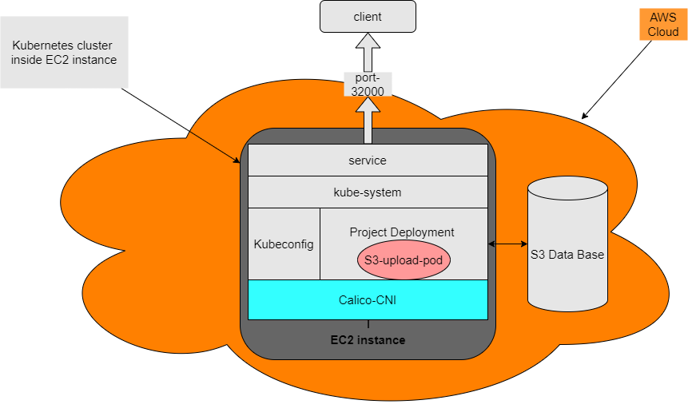

# S3-upload
A Terraform and Kubernetes infrastructure on AWS that build a S3 db and single EC2 instance and make it single node cluster, And on top of that it install with a custom helm chart and docker image a simple web app that upload image from your local computer to the S3  


## Table of contents
* [General info](#general-info)
* [Technologies](#technologies)
* [Preparations](#preparations)
* [Setup](#setup)

## General info
link to my demo video:

[Demo video](https://www.loom.com/share/48a60e4d13ff4b7ba8512c3b064aff65?sid=c8fc274f-1764-4ebc-bb8e-562c0d6e3fc2)

And some  helping drawing of the project little infrastructure:



## Technologies
#### for the app
  * Python (FastApi and boto3 library)
  * HTML
  * CSS
  * Javascript
#### infrastructure
  * Docker
  * HelmChart
  * Terraform
  * BashScript


## Preparations
before you start make sure you have those things in your AWS account. 
1. AWS IAM user with the right permissions
2. and Access keys ready to use


## Setup
> [!NOTE]
> the S3 need some time to load so there is a chance that when you enter the app through the web you could insert an image but not to see it when you go the album page.

to setup the project all you need is to edit the main.tf with the right AWS information.
#### Terraform tfstate config (recommended)
You can delete this section if you dont what to backkup the tfstate.
```terraform
backend "s3" {
 bucket = ""
 key = ""
 region = ""
 encrypt = true
 dynamodb_table = ""
 }
```
#### Provider
Fill the right region where your project is going to be deployed, and the access and secret key for Permissions to create the resource in your account.   
  
```terraform
provider "aws" {
  region = ""
  access_key = ""
  secret_key = ""
}
```
#### Module
Here we add the importent variable for the module, the location if the module can be find is the source variable. <br />
this section is split to two part: <br /> 
1. S3 connection where we need to add bucket name that will be unique and the same parameter for the Provider part.
2. the EC2 instance. in here we need to add the privet key location (c://my_user/key.pem)  
```terraform
module "s3_upload" {
  source = "./modules"
  # s3 connection
  AWS_BUCKET = ""
  AWS_ACCESS_KEY_ID = ""
  AWS_SECRET_ACCESS_KEY = ""
  REGION_NAME = ""

  # connection to the ec2 instance
  connection_private_key = ""
 }
```
